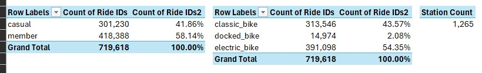
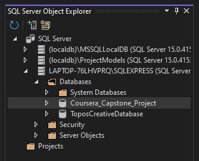
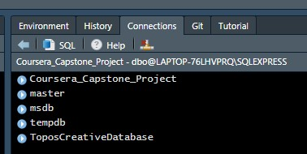

# Coursera - Case Study

As part of the [Google Data Analytics Professional Certificate](https://www.coursera.org/professional-certificates/google-data-analytics), I am to complete 1 (or more) case studies as the capstone for the course.

### Google Data Analytics Capstone: Complete a Case Study

Case Studies offered two tracks (1) chose one of two case studies to use and follow the instructions to work through the data analysis and visualization or (2) chose your own dataset. As a starter, I chose track 1, dataset 1.

### Track 1, Case study 1, : Cyclistic bike-share analysis

Coursera offered the following summary of this dataset and case study:

> "This is an opportunity to analyze historical bicycle trip data in order to identify trends. Understanding how casual riders behave differently from riders with paid memberships is important. This analysis will help executives to make decisions about marketing programs and strategies to convert casual riders to riders with annual memberships. Refer to Case Study 1: How Does a Bike-Share Navigate Speedy Success? for more details about this case study.-- In this case study, you will perform data analysis for a fictional bike-share company in order to help them attract more riders. Along the way, you will perform numerous real-world tasks of a junior data analyst by following the steps of the data analysis process: Ask, Prepare, Process, Analyze, Share, and Act. By the time you are done, you will have a portfolio-ready case study to help you demonstrate your knowledge and skills to potential employers!"

### Exploring The Data

Coursera provided a dataset from "[divvy-tripdata](https://divvy-tripdata.s3.amazonaws.com/index.html)" under public license to be used under the alias of Cyclistic Bike-Share, a fictitious company.

#### Reviewing the CSV

-   Gathering the Data: The data comes in zip files, mostly organized by month, except for a few quarter files, but those have older data and I wanted the most current available. One of the tasks I will have is to determine how I will migrate those individual months data into a single queryable table.

-   First, I saved the CSV as a macro enabled workbook to review the data before importing it. After migrating to Macro Enabled workbook file type, I tableized the data, and brought into Power Query, then loaded it to Connection Only, Add to Data Model. This way I can see what I'm working with.

-   Primary Key: ride_id is the Primary Key for the dataset. It appears the numbers are 16 digits long, however, I wanted to know if any were more than 16 digits long. I took the tableized data and brought it up into Excel's native Power Query, and added a column to extract the length of the IDs. The checked the filter on the new column to look for any non-16 items. I found many IDs less than and greater than 16, sorting descending, I found the largest was 27. This gave me context to ensure that when I created a table, the Primary Key will need to have a character length of at least 27, and since this is only one of the datasets, I decided to provide buffer room and make it 60.

    -   ride_id VARCHAR(16) PRIMARY KEY *(vs)* ride_id VARCHAR(60) PRIMARY KEY,

-   In this preliminary review of a single month in Excel, I discovered the following:

    -   People use classic and electric bikes about the same, and just over half of all riders are Members, the rest are casual users (almost half/half). Nearly all of the 1,256 Stations are used less than 1.00% of the time, with only one exception at Streeter Dr & G. This one stop may require further review.

        -   Casual (41.86%) vs Members (58.14%): Not a far enough gap to be significant.

        -   docked_bike is rarely used 2.08%: If this plays out should this either be eliminated or advertised more?

        -   classic_bike (43.57%) vs electric_bike (54.35%): Not a far enough gap to be significant.

        -   There are 1,265 Start/Stop stations; however, 16.1557% of all stops occured at a non-station.

            -   Only one station had stops of more than 1% of total rides, Streeter Dr & G




#### Gathering the data:

Big Query would not take the CSV, as it was too large. I was not interested in paying for Google Cloud to do this project. I set up a database on my local PC, created a table, and imported the data into my own localized database for analysis.

1.  I used Visual Studio 2022 to establish a new database on my local PC: "Coursera_Capstone_Project".



2.  I then established a connection to the database in RStudio

```{r eval=FALSE, message=FALSE, warning=FALSE, include=TRUE, paged.print=FALSE}
install.packages("DBI")
install.packages("odbc")

library(DBI)
library(odbc)

# This did not work:
# Server = "LAPTOP-76LHVPRQ\SQLEXPRESS",
# That worked!
# Server = "LAPTOP-76LHVPRQ\\SQLEXPRESS",

conn <- dbConnect(odbc(),
                  Driver = "SQL Server",
                  Server = "LAPTOP-76LHVPRQ\\SQLEXPRESS",
                  Database = "Coursera_Capstone_Project",
                  Trusted_Connection = "True")
```

*Note: At first, this code would not work, I checked my resources, and found that even though the actual file path has one backslash, the R code required a double backslash, in much the same way it requires `==` when using logical code.*



3.  With a connection to my local database, I can begin pulling CSVs into the database.
